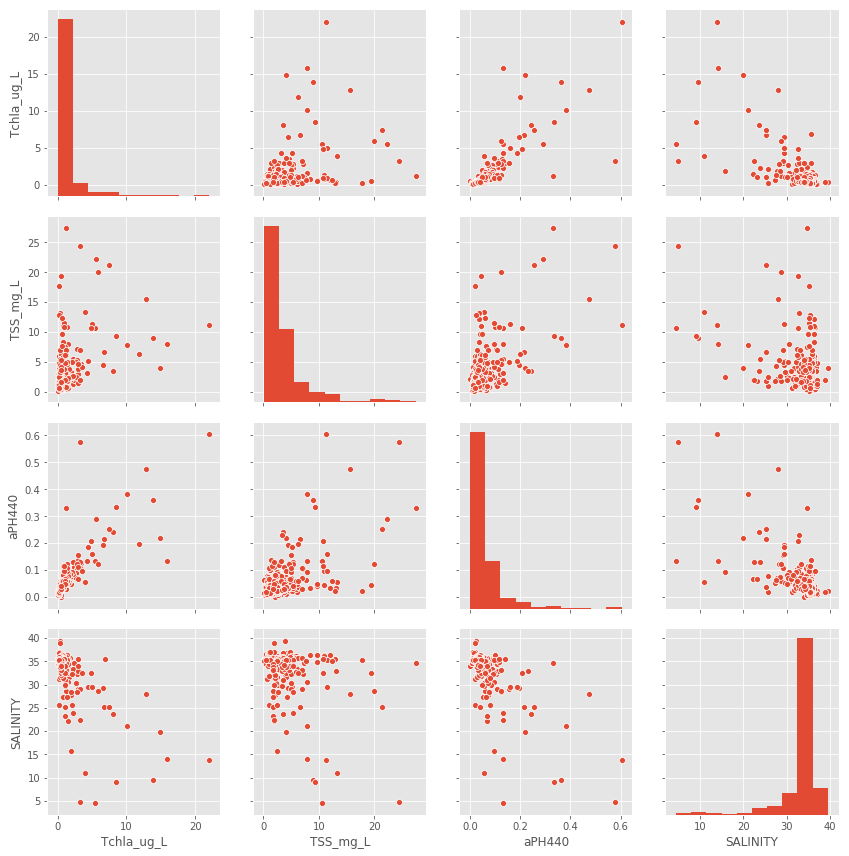
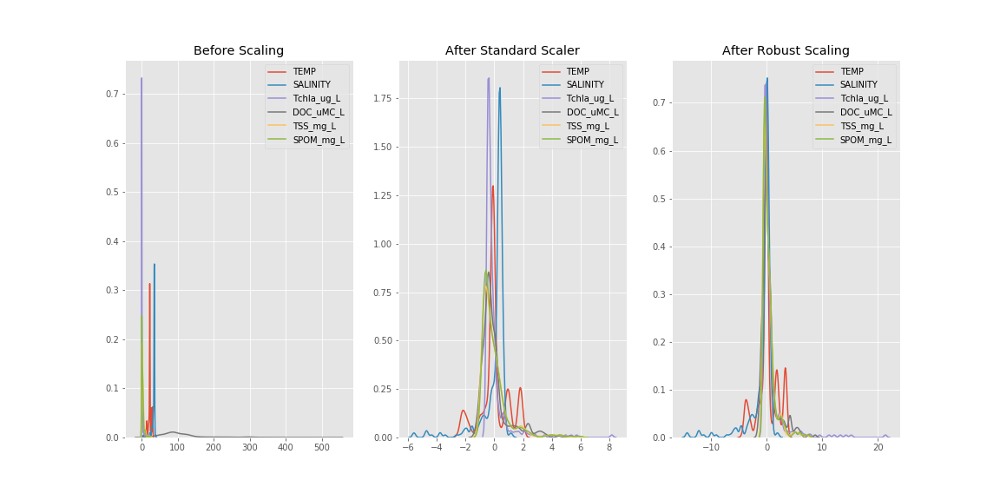
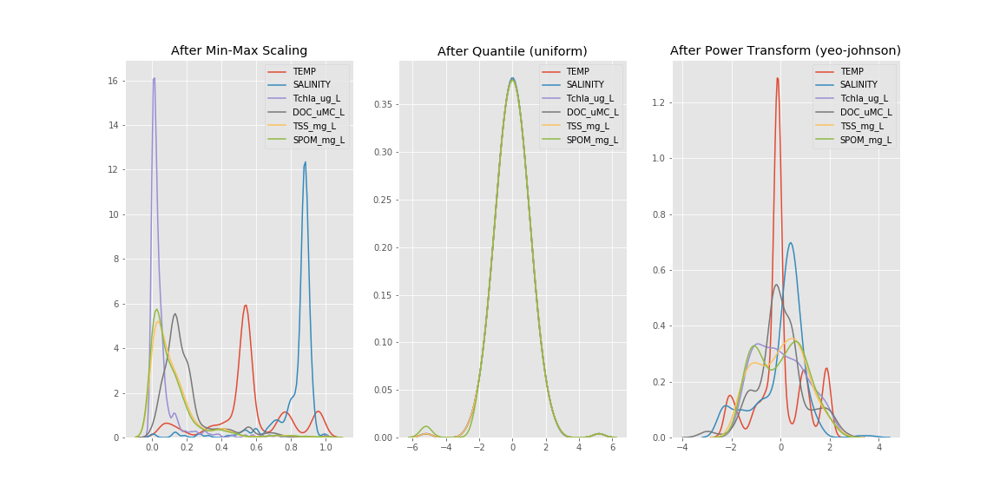
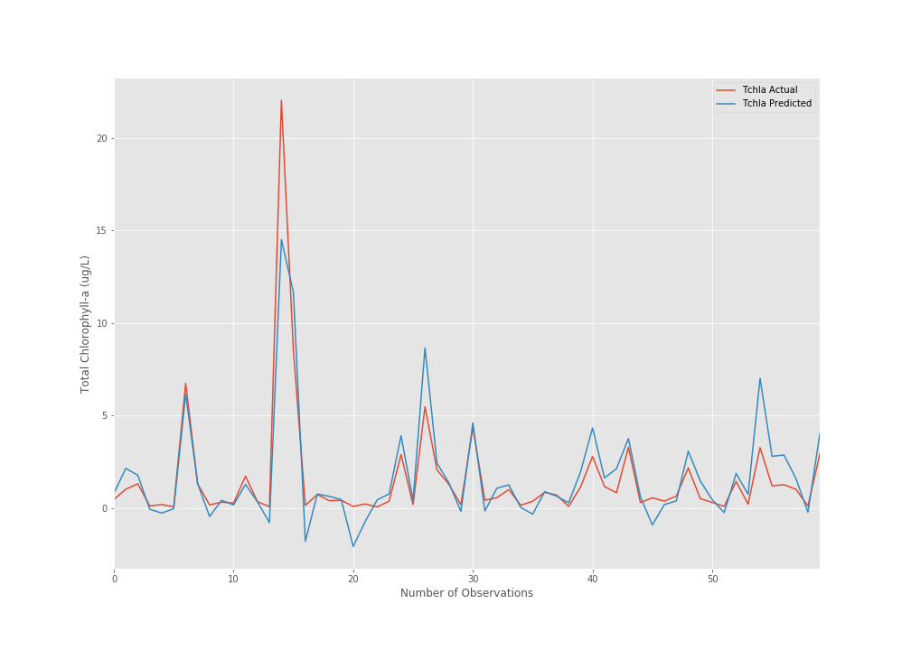

```{r setup, include=FALSE}
knitr::opts_chunk$set(
  results = 'asis',
  echo = FALSE,
  warning = FALSE,
  message = FALSE,
  fig.align = 'center'
)

#Load libraries
library(tidyverse)
library(gapminder)
library(gganimate)
library(kableExtra)
```

<br/>
<br/>

# Introduction

I'm an Ag&F experimental scientist from Plant & Oil Engineering Group working on the development and application of analytical chemistry methods using mass spectrometry. 
Previously to Data School, analyses of data were performed using Excel sheets and analysis on statistical software packages. 
<br/>
<br/>
<br/>
<br/>

# My Synthesis Project


My Synthesis Project aims to use Machine Learning to predict chlorophyll-a in ocean waters for monitoring and management of water quality. 


Chlorophyll-a concentration is an indicator of the ecological health of aquatic environments, and its distribution and intensity may reveal regional eutrophication and the levels of primary productivity. 
The data obtained for this study were collected during cruises conducted in five regions around Australian coast, including areas of high complexity biogeochemical processes.


This project analyses the performance of a machine learning model using multiple regression to predict chlorophyll-a concentrations from a set of environmental features.
The accuracy of each model is evaluated via the coefficient of determination (R2) and the mean absolute percentage error (MAPE). Optimization algoritms such as Stochastic Gradient Descent (SGD) method were used to find the best fit. Lasso Regression was also used for variable selection and improvement of prediction accuracy.
<br/>
<br/>
<br/>
<br/>

# My Digital Toolbox

For this project, I used the following digital tools:

* Python - SKlearn, numpy, matplotlib, seaborn, pandas, MICE-SKlearn,
statsmodels 
* GitHub
* GitBash
<br/>
<br/>
<br/>

# My time went ...

Most of the time was dedicated to preparation and pre-processing of data. The selection of the right tools for data imputation and standardization as well as getting to know the data and understanding relationships and behaviour were the most time consuming aspects of the project. 
<br/>
<br/>
<br/>

# Next steps

The next steps will involve a comparison of performances using different machine learning approaches.

Carrying on developing skills using Machine Learning aproaches and other Data School acquired skills (Python and R coding) in analytical chemistry field and mass spectrometry imaging.
<br/>
<br/>
<br/>


**Raw data: partial visualization (total data: 24 features, 296 obs, 7104 datapoints)**

{width=50%}


**Data scaling: comparing different scalers applied on data**
{width=60%}
{width=60%}


**Predicted X Actual: R score 0.79 **
{width=95%}

# My Data School Experience

Data School has been a fantastic experience. Machine Learning, statistical modelling, R and Python are my favourite tools. The data analysis methods and techniques learned in Data School are an essential component of modern approaches towards dealing with scientific data. The skills acquired in Data School will be applied in my daily work and certainly will improve productivity by automating the processing and analysis of data generated by analytical chemistry instrumentation.
The methods will also be applied for data standardization wich will transform the acquired data into a consistent and reproducible format, making it easier to analyse.
I plan to continue improving my skills on ML, statistical modelling and coding using Python and R. 


